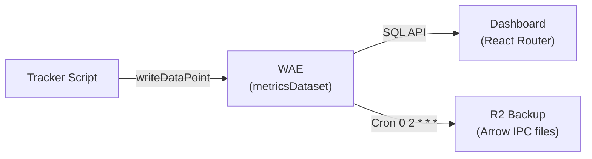
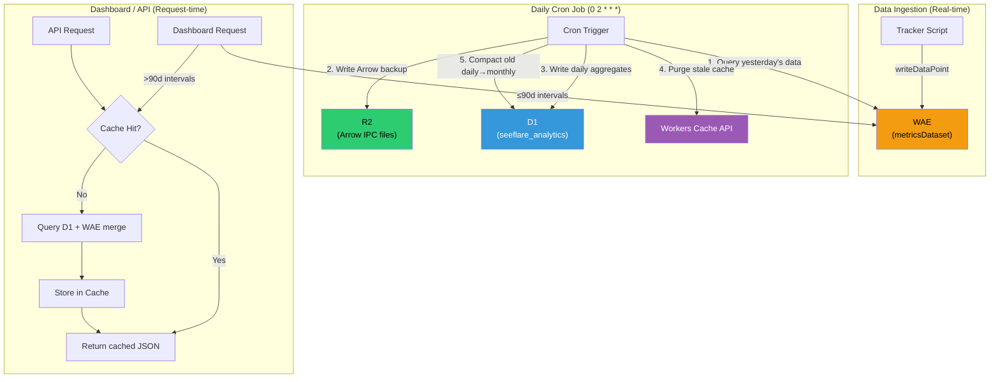
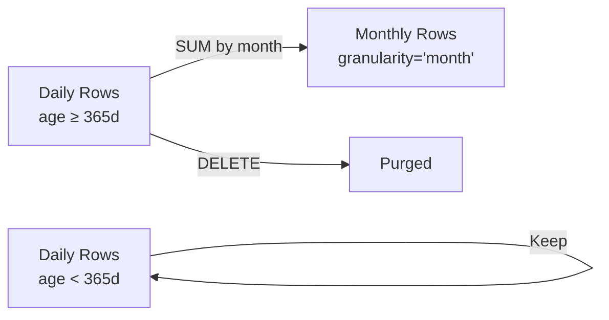
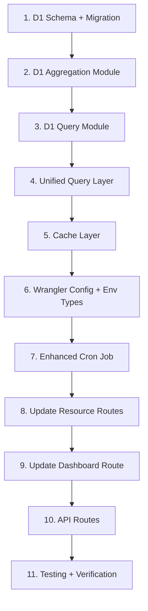

# Smart Aggregation, Extended Time Ranges & API for Seeflare

## Problem Statement

Seeflare (a Counterscale fork) currently relies exclusively on **Cloudflare Workers Analytics Engine (WAE)** for all data. WAE only retains data for **90 days**, meaning the dashboard cannot display any data beyond that window. The user wants:

1. **Extended time ranges**: 120d, 1y, 3y, 5y, and "all time"
2. **A public API** to allow users to build custom dashboards with complete data, matching the original dashboard 1:1
3. **A smart D1 aggregation system** that prevents the database from growing unboundedly while maintaining dashboard fidelity
4. **A caching layer** to minimize D1 read consumption
5. All while maintaining Counterscale's philosophy: **set it up once and forget it**

---

## Current Architecture



### Key Files

| Component | File | Purpose |
|-----------|------|---------|
| WAE Query Layer | [query.ts](file:///e:/Web/seeflare/packages/server/app/analytics/query.ts) | All WAE SQL queries via CF Analytics Engine SQL API |
| Schema | [schema.ts](file:///e:/Web/seeflare/packages/server/app/analytics/schema.ts) | Column mappings (15 blobs + 3 doubles) |
| Worker Entry | [app.ts](file:///e:/Web/seeflare/packages/server/workers/app.ts) | fetch + scheduled handlers |
| Arrow Backup | [arrow.ts](file:///e:/Web/seeflare/packages/server/workers/lib/arrow.ts) | Daily cron → R2 Arrow IPC backup |
| Dashboard | [dashboard.tsx](file:///e:/Web/seeflare/packages/server/app/routes/dashboard.tsx) | Main dashboard route (already has 120d–all selectors) |
| Stats | [resources.stats.tsx](file:///e:/Web/seeflare/packages/server/app/routes/resources.stats.tsx) | Visitors, views, bounce rate |
| Time Series | [resources.timeseries.tsx](file:///e:/Web/seeflare/packages/server/app/routes/resources.timeseries.tsx) | Chart data by interval |
| Resource Routes | `resources.*.tsx` | Country, browser, referrer, paths, UTMs, device |
| Load Context | [load-context.ts](file:///e:/Web/seeflare/packages/server/app/load-context.ts) | Creates AnalyticsEngineAPI instance |
| Config | [wrangler.json](file:///e:/Web/seeflare/packages/server/wrangler.json) | Bindings: WAE, R2, cron `0 2 * * *` |
| Env Types | [worker-configuration.d.ts](file:///e:/Web/seeflare/packages/server/worker-configuration.d.ts) | `CF_BEARER_TOKEN`, `CF_ACCOUNT_ID`, `DAILY_ROLLUPS`, `WEB_COUNTER_AE`, etc. |

### Current Data Tracked (per WAE event)

| Blob | Field | Blob | Field |
|------|-------|------|-------|
| blob1 | host | blob9 | browserVersion |
| blob2 | userAgent | blob10 | deviceType |
| blob3 | path | blob11 | utmSource |
| blob4 | country | blob12 | utmMedium |
| blob5 | referrer | blob13 | utmCampaign |
| blob6 | browserName | blob14 | utmTerm |
| blob7 | deviceModel | blob15 | utmContent |
| blob8 | siteId | | |
| double1 | newVisitor | double2 | newSession |
| double3 | bounce | | |

### Current Dashboard Components

The dashboard displays all of these via resource routes:
- **Stats**: Total visitors, views, bounce rate
- **Time Series**: Chart by hour/day intervals
- **Paths**: Top pages by visitors + views
- **Referrers**: Top referrers by visitors + views
- **Browsers**: Top browsers by visitors
- **Countries**: Top countries by visitors
- **Devices**: Top device types by visitors
- **UTM**: Source, Medium, Campaign, Term, Content

---

## User Review Required

> [!IMPORTANT]
> **D1 Binding Required**: This plan requires adding a D1 database binding to `wrangler.json`. You will need to create the D1 database in your Cloudflare dashboard first (`wrangler d1 create seeflare-analytics`).

> [!IMPORTANT]
> **Cache Strategy Recommendation**: After thorough research, **Workers Cache API** is recommended over KV for the caching layer. See the detailed comparison in the [Cache Strategy Analysis](#cache-strategy-workers-cache-api-vs-kv) section below. If you prefer KV, a KV binding can be used as a drop-in alternative.

> [!WARNING]
> **Arrow R2 Backups Must Not Have Gaps**: The current daily cron writes yesterday's WAE data to R2 as Arrow IPC files. This plan depends on those backups being complete and uninterrupted from when the system was first deployed. If there are missing days, the D1 aggregation will have gaps for those dates that can never be backfilled (since WAE only retains 90 days).

> [!WARNING]
> **WAE Sampling at Scale**: Cloudflare Analytics Engine uses adaptive sampling for high-traffic sites. The D1 aggregated data will reflect the same sampling as WAE (using `SUM(_sample_interval)`), meaning at very high scale, counts are statistical estimates, not exact. This is the same behavior the dashboard already exhibits today.

---

## Resolved Decisions

> [!NOTE]
> **API Cache Key Isolation**: API routes must use distinct cache key prefixes (e.g., `api-analytics-stats` instead of `stats`) despite sharing the same underlying cache mechanism as the dashboard. This prevents Data Shape Collisions (Cache Poisoning) since the internal UI and public API expect slightly different JSON schemas (e.g., camelCase vs snake_case).

> [!NOTE]
> **API Authentication**: Use the same JWT authentication system as the dashboard. This keeps the API aligned with the existing security model and avoids adding setup complexity. A separate API key mechanism can be added later as an optional enhancement for third-party integrations.

> [!NOTE]
> **"All Time" Lower Bound**: Use dynamic detection based on the earliest available data in D1 (via `aggregation_metadata`) or R2 backup metadata. No hardcoded lower bound — "all time" accurately reflects the real data available for each deployment.

> [!NOTE]
> **Filter Support for Extended Ranges**: Full filter support confirmed. Extended ranges support all the same filters as the existing dashboard (path, referrer, country, browser, device, UTMs). Per-dimension aggregates are stored in D1 to maintain 1:1 dashboard parity.

> [!NOTE]
> **D1 Row Pruning Age**: 365 days as the default compaction threshold, configurable via `CF_D1_COMPACTION_DAYS` environment variable (or a constant in code). Daily granularity is kept for the most recent year; older data is compacted into monthly aggregates.

---

## Technical Feasibility Assessment

### ✅ Confirmed Feasible

| Capability | Evidence |
|-----------|----------|
| D1 as aggregation store | D1 supports up to 10 GB (paid), 25M free reads/day, standard SQL |
| Cron trigger → D1 writes | Cron-triggered Workers can read WAE SQL API and write to D1 within the 30s CPU limit (paid plan) |
| Cron trigger → R2 writes | Already implemented in [arrow.ts](file:///e:/Web/seeflare/packages/server/workers/lib/arrow.ts) |
| Workers Cache API | Available in all Workers, supports `cache.put()` / `cache.match()` / `cache.delete()` with TTL |
| Arrow IPC in Workers | Already using `apache-arrow` v21 — `tableFromJSON()`, `tableToIPC()` work in Workers runtime |
| API routes in React Router | Can add new routes at `app/routes/api.*.tsx` using existing React Router loader pattern |
| Extended intervals in WAE | WAE queries already support arbitrary day ranges via `intervalToSql()` — just limited by 90d retention |

### ⚠️ Constraints & Limitations

| Constraint | Impact | Mitigation |
|-----------|--------|-----------|
| WAE retains only 90 days | Cannot query historical data beyond 90 days directly | D1 stores daily aggregates extracted before data expires |
| D1 free tier: 5M reads/day, 100K writes/day | Heavy dashboard usage could approach limits | Cache API layer reduces reads to ~1/day per unique query |
| D1 paid plan: 25B reads, 50M writes/month | Very generous for analytics aggregates | Monthly aggregation compaction keeps writes bounded |
| Cron CPU limit: 15ms free / 30s paid | Must complete aggregation within time limit | Daily aggregation for single day is fast; batch R2 backfill may need chunking |
| D1 max DB size: 10 GB (paid) | Long-term growth concern | Monthly roll-up compaction + purging old daily rows controls growth |
| Workers Cache API is per-colo | Cache may be cold in rarely-used PoPs | Acceptable — first request per colo is slightly slower, subsequent ones fast |
| No D1 in current wrangler.json | Must add binding | Simple config addition |

---

## Cache Strategy: Workers Cache API vs KV

| Factor | Workers Cache API | KV |
|--------|------------------|----|
| **Read latency** | <1ms (same colo, edge) | ~10-60ms (eventually consistent) |
| **Write latency** | Instant (same colo) | <60s global propagation |
| **Read cost** | **Free** (unlimited) | 10M free reads/day, then $0.50/M |
| **Write cost** | **Free** (unlimited) | 1M free writes/day, then $5/M |
| **Storage cost** | **Free** (Cloudflare manages) | 1GB free, then $0.50/GB-month |
| **TTL control** | ✅ Via `Cache-Control` headers | ✅ Via `expirationTtl` |
| **Programmatic purge** | ✅ `cache.delete(url)` | ✅ `KV.delete(key)` |
| **Per-colo vs global** | Per-colo (cold in new PoPs) | Global (eventually consistent) |
| **Max value size** | 512 MB | 25 MB |
| **Best for** | High-read, same-origin caching | Cross-worker shared state |

### Recommendation: **Workers Cache API**

**Rationale**:
1. **Zero cost** — No read/write charges at any scale
2. **Lowest latency** — Sub-millisecond for cached responses
3. **Perfect fit** — Analytics data is read-heavy, changes daily, and is always accessed from the same Worker
4. **Simple invalidation** — Cron job calls `cache.delete()` after writing new aggregates
5. **No additional binding needed** — Cache API is globally available (`caches.default`)

KV would be the fallback if global consistency matters (e.g., multi-Worker architecture), but for a single-Worker dashboard, Cache API is strictly superior.

---

## Proposed Architecture



### Data Flow Summary

1. **≤90 days**: Query WAE directly (current behavior, unchanged)
2. **>90 days**: Merge WAE data (last 90d) + D1 aggregates (older data), cache result
3. **Daily cron**: Extract yesterday from WAE → write to D1 + R2, purge relevant cache entries, compact old data
4. **API**: Same data sources, same merge logic, authenticated JSON responses

---

## D1 Database Schema

### Design Principles

1. **Daily granularity** — Store one row per (date, site, dimension_type, dimension_value)
2. **Dimension-based storage** — A single table with a `dimension_type` + `dimension_value` pattern instead of per-column tables
3. **Monthly compaction** — After 365 days, daily rows are compacted into monthly summaries
4. **Self-maintaining** — The cron job handles all lifecycle management automatically

### Table: `daily_aggregates`

```sql
CREATE TABLE IF NOT EXISTS daily_aggregates (
    id INTEGER PRIMARY KEY AUTOINCREMENT,
    date TEXT NOT NULL,              -- 'YYYY-MM-DD' for daily, 'YYYY-MM' for monthly
    granularity TEXT NOT NULL DEFAULT 'day', -- 'day' or 'month'
    site_id TEXT NOT NULL,
    dimension_type TEXT NOT NULL,    -- 'overall', 'path', 'referrer', 'country', 
                                    -- 'browserName', 'deviceType', 'browserVersion',
                                    -- 'deviceModel', 'utmSource', 'utmMedium',
                                    -- 'utmCampaign', 'utmTerm', 'utmContent'
    dimension_value TEXT NOT NULL DEFAULT '', -- e.g. '/about', 'google.com', 'US'
    views INTEGER NOT NULL DEFAULT 0,
    visitors INTEGER NOT NULL DEFAULT 0,
    bounces INTEGER NOT NULL DEFAULT 0,
    created_at TEXT NOT NULL DEFAULT (datetime('now')),
    
    UNIQUE(date, site_id, dimension_type, dimension_value, granularity)
);

-- Query indexes
CREATE INDEX IF NOT EXISTS idx_daily_agg_lookup 
    ON daily_aggregates(site_id, dimension_type, date, granularity);
CREATE INDEX IF NOT EXISTS idx_daily_agg_date 
    ON daily_aggregates(date, granularity);
CREATE INDEX IF NOT EXISTS idx_daily_agg_compact 
    ON daily_aggregates(granularity, date);
```

### Table: `aggregation_metadata`

```sql
CREATE TABLE IF NOT EXISTS aggregation_metadata (
    key TEXT PRIMARY KEY,
    value TEXT NOT NULL,
    updated_at TEXT NOT NULL DEFAULT (datetime('now'))
);

-- Tracks:
-- 'last_aggregated_date' → '2026-05-28'  (last date successfully aggregated)
-- 'last_compaction_date' → '2025-05-01'  (last month that was compacted)
-- 'schema_version' → '1'
```

### Storage Estimate

For a site with moderate traffic:

| Dimension | Unique Values/Day (estimate) | Rows/Day |
|-----------|------------------------------|----------|
| overall | 1 | 1 |
| path | ~50 | 50 |
| referrer | ~30 | 30 |
| country | ~20 | 20 |
| browserName | ~8 | 8 |
| browserVersion | ~15 | 15 |
| deviceType | ~4 | 4 |
| deviceModel | ~20 | 20 |
| utmSource | ~5 | 5 |
| utmMedium | ~3 | 3 |
| utmCampaign | ~3 | 3 |
| utmTerm | ~2 | 2 |
| utmContent | ~2 | 2 |
| **Total** | | **~163** |

**Per site per year**: ~163 rows/day × 365 days = **~59,500 rows/year**
- After monthly compaction (>1 year old): ~163 × 12 = **~1,956 rows/year** (compacted)
- Average row size: ~120 bytes
- **~7 MB/year per site** (before compaction), **~230 KB/year** (after compaction)

> [!TIP]
> For a single-site deployment, D1's 500 MB free tier can store **~70+ years** of daily data, or effectively infinite data after compaction. Even with 10 sites, this is well within the 10 GB paid limit.

---

## Monthly Compaction Strategy



### Compaction Algorithm

```
1. Find months where ALL days are older than 365 days
2. For each such month (e.g., '2025-04'):
   a. INSERT INTO daily_aggregates (date, granularity='month', ...)
      SELECT strftime('%Y-%m', date), 'month', site_id, dimension_type, dimension_value,
             SUM(views), SUM(visitors), SUM(bounces)
      FROM daily_aggregates
      WHERE date BETWEEN '2025-04-01' AND '2025-04-30'
        AND granularity = 'day'
      GROUP BY site_id, dimension_type, dimension_value
   b. DELETE FROM daily_aggregates
      WHERE date BETWEEN '2025-04-01' AND '2025-04-30'
        AND granularity = 'day'
3. Update aggregation_metadata set last_compaction_date
```

### Dashboard Granularity Impact

| Time Range | Chart Granularity | Data Source |
|-----------|-------------------|-------------|
| today, yesterday, 1d | Hourly | WAE only |
| 7d, 30d, 90d | Daily | WAE only |
| 120d | Daily | WAE (last 90d) + D1 daily (30d) |
| 1y (365d) | Daily | WAE (last 90d) + D1 daily (275d) |
| 3y (1095d) | Daily (<1y) + Monthly (>1y) | WAE + D1 mixed |
| 5y (1825d) | Daily (<1y) + Monthly (>1y) | WAE + D1 mixed |
| all | Daily (<1y) + Monthly (>1y) | WAE + D1 mixed |

---

## Proposed Changes

### Component 1: D1 Database Layer

#### [NEW] [d1-schema.sql](file:///e:/Web/seeflare/packages/server/app/analytics/d1-schema.sql)
SQL migration file containing the D1 schema (tables + indexes).

#### [NEW] [d1-aggregation.ts](file:///e:/Web/seeflare/packages/server/app/analytics/d1-aggregation.ts)
Core D1 aggregation module:
- `aggregateDay(db, api, date, sites[])` — Extract a single day from WAE, write dimension breakdowns to D1
- `compactOldData(db, cutoffDate)` — Roll daily → monthly for old data
- `getAggregatedData(db, siteId, startDate, endDate, dimensionType, dimensionValue?)` — Query D1 for historical data
- `getLastAggregatedDate(db)` / `setLastAggregatedDate(db, date)` — Metadata helpers
- `backfillFromR2(db, bucket, startDate, endDate)` — One-time R2 backfill for initial deployment

#### [NEW] [d1-query.ts](file:///e:/Web/seeflare/packages/server/app/analytics/d1-query.ts)
D1-specific query functions matching the WAE query interface:
- `getD1Counts(db, siteId, startDate, endDate)` — views, visitors, bounces from D1
- `getD1ViewsGroupedByInterval(db, siteId, startDate, endDate)` — time series from D1
- `getD1CountByColumn(db, siteId, column, startDate, endDate, page, limit)` — dimension breakdowns from D1
- Each function returns data in the **same format** as the corresponding WAE query function

---

### Component 2: Unified Query Layer (WAE + D1 Merge)

#### [NEW] [unified-query.ts](file:///e:/Web/seeflare/packages/server/app/analytics/unified-query.ts)
A unified query layer that transparently merges WAE and D1 data:
- For ≤90d intervals: delegate entirely to WAE (no change)
- For >90d intervals: query D1 for older period + WAE for recent period, merge results
- Merge functions handle deduplication of the overlap window (WAE data takes priority for dates that exist in both)
- Exposes the same method signatures as `AnalyticsEngineAPI` so dashboard routes need minimal changes

---

### Component 3: Caching Layer (Workers Cache API)

#### [NEW] [cache-layer.ts](file:///e:/Web/seeflare/packages/server/app/analytics/cache-layer.ts)
Cache wrapper around the unified query layer:
- `getCachedOrFetch(cacheKey, fetcher, ttl?)` — Generic cache-through function
- Uses `caches.default` (Workers Cache API)
- Cache keys are URL-based: `https://seeflare-cache.internal/{route}?{params}`
- Default TTL: 24 hours (since data only changes daily via cron)
- `purgeCache(patterns[])` — Called by cron after daily aggregation to invalidate stale entries

#### Cache Key Strategy
```
https://seeflare-cache.internal/stats?site={siteId}&interval={interval}&tz={tz}&filters={hash}
https://seeflare-cache.internal/timeseries?site={siteId}&interval={interval}&tz={tz}&filters={hash}
https://seeflare-cache.internal/country?site={siteId}&interval={interval}&tz={tz}&page={page}
...etc for each resource route
```

---

### Component 4: Enhanced Cron Job

#### [MODIFY] [app.ts](file:///e:/Web/seeflare/packages/server/workers/app.ts)
Expand the `scheduled()` handler to:
1. Run existing Arrow R2 backup (unchanged)
2. **NEW**: Run daily D1 aggregation for yesterday's date
3. **NEW**: Run monthly compaction for data older than 365 days
4. **NEW**: Purge Workers Cache API entries for affected intervals
5. **NEW**: Handle initial backfill from R2 if D1 is empty (first-run setup)

#### [MODIFY] [wrangler.json](file:///e:/Web/seeflare/packages/server/wrangler.json)
Add D1 database binding:
```json
{
    "d1_databases": [
        {
            "binding": "ANALYTICS_DB",
            "database_name": "seeflare-analytics",
            "database_id": "<your-d1-database-id>"
        }
    ]
}
```

---

### Component 5: Extended Time Ranges in Query Layer

#### [MODIFY] [query.ts](file:///e:/Web/seeflare/packages/server/app/analytics/query.ts)
Update `intervalToSql()` to support `120d`, `365d`, `1095d`, `1825d`, `all`:
- For intervals ≤ 90d: current WAE-only logic (unchanged)
- For intervals > 90d: the unified query layer handles the split automatically

#### [MODIFY] [utils.ts](file:///e:/Web/seeflare/packages/server/app/lib/utils.ts)
Update `getIntervalType()` and `getDateTimeRange()`:
- Add `"WEEK"` and `"MONTH"` interval types for very long ranges
- `getDateTimeRange()` must handle `"all"` interval (query metadata for earliest date)
- Add helper: `isExtendedInterval(interval)` — returns true for >90d intervals

---

### Component 6: Dashboard Route Updates

#### [MODIFY] [resources.stats.tsx](file:///e:/Web/seeflare/packages/server/app/routes/resources.stats.tsx)
Replace direct `analyticsEngine` calls with unified query layer calls for extended intervals.

#### [MODIFY] [resources.timeseries.tsx](file:///e:/Web/seeflare/packages/server/app/routes/resources.timeseries.tsx)
Same pattern — use unified query layer, handle mixed daily/monthly granularity in chart.

#### [MODIFY] [resources.paths.tsx](file:///e:/Web/seeflare/packages/server/app/routes/resources.paths.tsx)
#### [MODIFY] [resources.referrer.tsx](file:///e:/Web/seeflare/packages/server/app/routes/resources.referrer.tsx)
#### [MODIFY] [resources.country.tsx](file:///e:/Web/seeflare/packages/server/app/routes/resources.country.tsx)
#### [MODIFY] [resources.browser.tsx](file:///e:/Web/seeflare/packages/server/app/routes/resources.browser.tsx)
#### [MODIFY] [resources.browserversion.tsx](file:///e:/Web/seeflare/packages/server/app/routes/resources.browserversion.tsx)
#### [MODIFY] [resources.device.tsx](file:///e:/Web/seeflare/packages/server/app/routes/resources.device.tsx)
#### [MODIFY] [resources.utm-source.tsx](file:///e:/Web/seeflare/packages/server/app/routes/resources.utm-source.tsx)
#### [MODIFY] [resources.utm-medium.tsx](file:///e:/Web/seeflare/packages/server/app/routes/resources.utm-medium.tsx)
#### [MODIFY] [resources.utm-campaign.tsx](file:///e:/Web/seeflare/packages/server/app/routes/resources.utm-campaign.tsx)
#### [MODIFY] [resources.utm-term.tsx](file:///e:/Web/seeflare/packages/server/app/routes/resources.utm-term.tsx)
#### [MODIFY] [resources.utm-content.tsx](file:///e:/Web/seeflare/packages/server/app/routes/resources.utm-content.tsx)

All resource routes will be updated to:
1. Accept the unified query context (which includes both WAE + D1 access)
2. Use the cache layer for extended intervals
3. Return identical response shapes (no frontend component changes needed)

#### [MODIFY] [load-context.ts](file:///e:/Web/seeflare/packages/server/app/load-context.ts)
Add D1 database to the load context so all routes can access it:
```typescript
interface AppLoadContext {
    cloudflare: Cloudflare;
    analyticsEngine: AnalyticsEngineAPI;
    db: D1Database;           // NEW
}
```

#### [MODIFY] [dashboard.tsx](file:///e:/Web/seeflare/packages/server/app/routes/dashboard.tsx)
- Update `MAX_RETENTION_DAYS` logic to check D1 for earliest available data
- The time range dropdown already has 120d–all options (added in previous work)

---

### Component 7: API Routes

#### [NEW] [api.analytics.ts](file:///e:/Web/seeflare/packages/server/app/routes/api.analytics.ts)
Public API endpoint that exposes all dashboard data:

```
GET /api/analytics?site={siteId}&interval={interval}&tz={tz}&filters={...}
```

Response (JSON):
```json
{
  "meta": {
    "site": "example.com",
    "interval": "365d",
    "timezone": "Asia/Jakarta",
    "generated_at": "2026-05-30T02:00:00Z",
    "data_sources": ["wae", "d1"],
    "cache_hit": true
  },
  "stats": {
    "views": 125000,
    "visitors": 45000,
    "bounce_rate": 0.42
  },
  "timeseries": [
    { "date": "2025-06-01", "views": 340, "visitors": 120, "bounce_rate": 45 },
    ...
  ],
  "paths": [
    { "path": "/", "visitors": 12000, "views": 18000 },
    ...
  ],
  "referrers": [
    { "referrer": "google.com", "visitors": 8000, "views": 12000 },
    ...
  ],
  "countries": [
    { "country": "US", "visitors": 15000 },
    ...
  ],
  "browsers": [
    { "browser": "Chrome", "visitors": 20000 },
    ...
  ],
  "devices": [
    { "device": "Desktop", "visitors": 30000 },
    ...
  ],
  "utm": {
    "sources": [...],
    "mediums": [...],
    "campaigns": [...],
    "terms": [...],
    "contents": [...]
  }
}
```

#### [NEW] [api.analytics.timeseries.ts](file:///e:/Web/seeflare/packages/server/app/routes/api.analytics.timeseries.ts)
Individual endpoint for just time series data (lighter weight):
```
GET /api/analytics/timeseries?site={siteId}&interval={interval}&tz={tz}
```

#### [NEW] [api.analytics.stats.ts](file:///e:/Web/seeflare/packages/server/app/routes/api.analytics.stats.ts)
Individual endpoint for just stats data.

#### [NEW] [api.analytics.[dimension].ts](file:///e:/Web/seeflare/packages/server/app/routes/api.analytics.$dimension.ts)
Dynamic route for per-dimension queries:
```
GET /api/analytics/paths?site={siteId}&interval={interval}&page=1
GET /api/analytics/countries?site={siteId}&interval={interval}
GET /api/analytics/browsers?site={siteId}&interval={interval}
...etc
```

All API routes:
- Require authentication (same JWT auth as dashboard)
- Use the same unified query + cache layer as the dashboard, **but with distinct cache key prefixes** (e.g., `api-analytics-stats` instead of `stats`) to prevent Cache Poisoning and Data Shape Collisions between the internal dashboard UI and the external API.
- Return JSON with consistent response envelope
- Support pagination via `page` parameter
- Support all filters the dashboard supports

---

### Component 8: Env & Types Updates

#### [MODIFY] [worker-configuration.d.ts](file:///e:/Web/seeflare/packages/server/worker-configuration.d.ts)
Add `ANALYTICS_DB: D1Database` to the Env interface. (Regenerated via `wrangler types`)

#### [NEW] [types/api.ts](file:///e:/Web/seeflare/packages/server/app/lib/types/api.ts)
TypeScript types for API response shapes.

---

## Advantages

1. **1:1 Dashboard Parity**: Extended ranges show identical data types (paths, referrers, countries, browsers, UTMs, etc.) as the WAE-backed ranges
2. **Zero Maintenance**: Daily cron handles aggregation, compaction, cache purging, and R2 backup automatically
3. **Cost Efficient**: Workers Cache API is free; D1 reads are minimized to ~1/day per unique query thanks to caching
4. **Bounded Growth**: Monthly compaction ensures D1 never grows unboundedly — decades of data fit in <1 GB
5. **Graceful Degradation**: If D1 is unavailable, ≤90d queries still work via WAE alone
6. **API-First**: Full API access enables custom dashboards, integrations, and data export
7. **No Breaking Changes**: Existing dashboard features remain completely intact
8. **Set It and Forget It**: After initial deployment, no manual intervention needed

## Disadvantages

1. **Added Complexity**: Introduces D1, cache layer, and merge logic on top of the existing WAE-only system
2. **Data Delay**: D1 data is always 1 day behind (aggregated at 02:00 UTC); "today" and "yesterday" intervals always use WAE
3. **First-Run Backfill**: If R2 backups exist, initial D1 population requires a one-time backfill process (reading all Arrow files from R2)
4. **Monthly Aggregation Loses Daily Granularity**: Data older than 1 year only has monthly granularity in the time series chart — daily drill-down is lost
5. **Per-Colo Caching**: Workers Cache API is per-colo, so the first request from a new PoP will be uncached (cold start)

## Limitations

1. **Cannot Backfill Before First R2 Backup**: If the system has been running for 2 years but R2 backups only started 6 months ago, only 6 months of historical data can be imported to D1
2. **WAE Sampling**: High-traffic sites use WAE's adaptive sampling, so historical D1 data inherits the same statistical nature
3. **No Realtime Extended Data**: Extended range data updates once daily; intra-day changes only appear for the WAE-backed portion (≤90d)
4. **D1 Free Tier Write Limit**: 100K writes/day — for sites with extremely high dimension cardinality (thousands of unique paths/day), the daily aggregation could approach this limit
5. **Filter Combinations**: D1 stores single-dimension aggregates (not cross-dimension). You cannot filter by `path=/about AND country=US` in extended ranges unless we store every combination (exponential growth). This matches WAE behavior where such cross-filtering is also limited.

## Technical Risks

| Risk | Severity | Probability | Mitigation |
|------|----------|-------------|-----------|
| Cron job times out during aggregation | Medium | Low | Aggregation is single-day, small data volume; chunking if needed |
| D1 write limits exceeded (free tier) | Medium | Low | Monitor cardinality; monthly compaction reduces total rows |
| Cache API cold misses in new PoPs | Low | Medium | Acceptable UX — first load slightly slower, subsequent loads instant |
| Arrow IPC parsing in Workers | Low | Low | Already proven with `apache-arrow` v21 in existing codebase |
| D1 query performance for large time ranges | Medium | Low | Indexed queries; cache prevents repeated D1 reads |
| R2 backfill timeout for large historical data | Medium | Medium | Chunk backfill across multiple cron invocations with state tracking |
| WAE API rate limits during aggregation | Low | Low | Single query per aggregation; well within limits |

---

## Verification Plan

### Automated Tests

1. **D1 Aggregation Tests** (`vitest`):
   - Test `aggregateDay()` writes correct rows for mock WAE data
   - Test `compactOldData()` correctly merges daily → monthly
   - Test deduplication in overlap window

2. **Unified Query Tests**:
   - Test WAE-only path for ≤90d intervals
   - Test merge logic for >90d intervals
   - Test "all" interval with mock D1 data

3. **Cache Layer Tests**:
   - Test cache hit/miss behavior
   - Test cache invalidation via `purgeCache()`

4. **API Tests**:
   - Test all API endpoints return correct shapes
   - Test authentication enforcement
   - Test pagination
   - Test filter parameters

5. **Build verification**:
   ```bash
   cd packages/server
   npm run build
   npm run typecheck
   npm run test
   ```

### Manual Verification

1. **Local Preview**: Run `npm run preview` with a local D1 database to verify dashboard rendering with extended ranges
2. **Cron Simulation**: Trigger the cron handler manually via `wrangler dev` and verify D1 population
3. **API Testing**: Use `curl` or Postman to test API endpoints with authentication
4. **Dashboard Visual Check**: Verify that 120d, 1y, 3y, 5y, and "all" intervals render correctly in the dashboard with both chart and dimension tables
5. **Cache Verification**: Check that subsequent loads of the same interval are significantly faster

---

## Implementation Order



**Estimated effort**: 3–5 focused implementation sessions.
