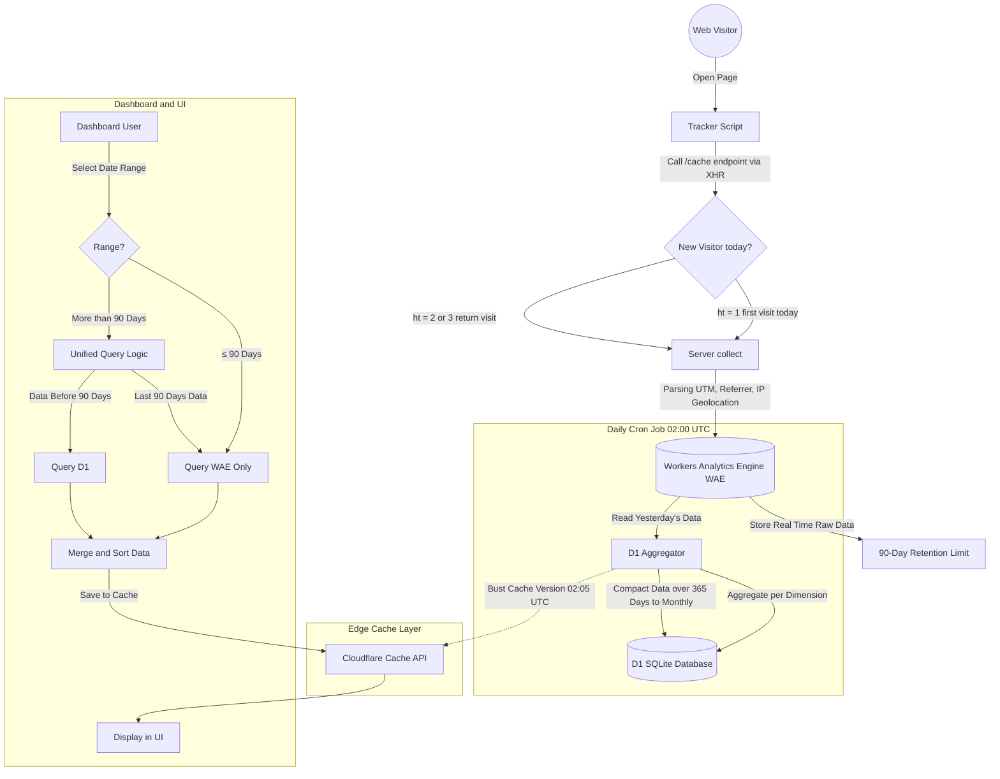

# Seeflare Architecture & How It Works (Deep Dive)

Seeflare is a modern web analytics platform designed on top of the Cloudflare ecosystem. Its main goal is to provide analytics that are **super fast**, **cookieless (privacy-respecting)**, and **keep history forever** without bloated database storage costs.

Here is an in-depth explanation (including a 1:1 technical discussion corresponding to the *codebase* structure) of how all the system components operate harmoniously.

---

## 1. Overall Architecture Flowchart

---

## 2. Tracker (Data Collection on Client)
**Code Location:** `packages/tracker/src/`

The tracker is a small *script* installed on the client side (visitor's browser).
- **Technical Discussion:** The tracker reads `window.location` and automatically parses elements like *hostname*, *path*, UTM parameters, and *referrer* (both from `document.referrer` and URL parameters).
- **Cookieless Tracking:** The tracker does not use `document.cookie` or `localStorage` to track unique visitors (thus being free from *Cookie Banner* regulations). Instead, the system uses the `checkCacheStatus()` function via a **two-phase request process**:

  **Phase 1 — Hit Count Check:** The tracker makes an active XHR `GET` request to the `/cache` endpoint on the server, passing the `sid` (Site ID). This endpoint evaluates the `If-Modified-Since` header sent by the browser's native cache and returns a **JSON response `{ ht: number }`** indicating the hit count for the current visitor. It also sets a `Last-Modified` header on the response so the browser will send `If-Modified-Since` on subsequent requests. The tracker reads the `ht` value from the JSON body.

  - If `ht = 1`, it is the first visit today (new unique visitor).
  - If `ht = 2`, it is a return visit (triggers anti-bounce correction).
  - If `ht = 3` or more, it is a regular page view (capped at 3 to avoid exposing exact counts publicly).

  **Phase 2 — Send Analytics:** After obtaining the hit count, the tracker sends a second `GET /collect?sid=...&ht=...&p=...` request containing the full analytics payload (path, referrer, UTM parameters, hit type) via `XMLHttpRequest` (XHR).

---

## 3. Server (`/collect` Intake Endpoint)
**Code Location:** `packages/server/app/analytics/collect.ts`

The `/collect` endpoint is the gateway for high-speed analytics traffic.
- **Technical Discussion:** When a `GET` request comes in, the `collectRequestHandler` function will do the following:
  1. Extract data from the *query string* (such as `sid` for Site ID, `p` for Path, `r` for Referrer).
  2. Parse the `User-Agent` to get the Browser version and Device model (Desktop/Mobile).
  3. Fetch Cloudflare-specific properties (`request.cf.country`) to detect the country of origin based on IP.
  4. Translate the *Hit Count* (from the `ht` parameter) into a *Bounce Value*: if *hit* = 1 it is counted as a *bounce*, if *hit* = 2 it is counted as an *anti-bounce* to correct the previous one, and if *hit* = 3 or more it has no bounce effect.
  5. Write the `DataPoint` structure (containing *Indexes*, 15 text *Blobs*, and numerical *Doubles*) directly to the **Workers Analytics Engine (WAE)**.
  6. Return a binary transparent image of type `image/gif` with a 1x1 *pixel* format and the `Tk: "N"` (Not tracked) *header*, as well as a modified time *header* as a cache marker.

---

## 4. Workers Analytics Engine (WAE) - Primary Database
**Code Location:** `packages/server/app/analytics/query.ts`

WAE is a *time-series* analytics data storage from Cloudflare.
- **Technical Discussion:** WAE is designed for *Write-Heavy workloads* (capable of ingesting millions of events per second without delay). Therefore, Seeflare chose this as the frontline.
- **Trade-Off (90-Day Limit):** Based on Cloudflare rules, detailed data in WAE only lasts for a maximum of 90 days. WAE is suitable for a *real-time dashboard* and short-term heavy queries (using SQL via the Cloudflare API), but old data will be permanently deleted by the central system.

---

## 5. D1 Aggregation (Aggregator & Historical Storage)
**Code Location:** `packages/server/app/analytics/d1-aggregation.ts`

To solve WAE's 90-day limit problem, Seeflare uses a daily *Cron Job* and a relational database **D1 (SQLite)**.
- **Technical Discussion:**
  The `runDailyAggregation` function is triggered every day at 02:00 UTC. This process will:
  1. *Query* WAE to read all total visitors, *views*, and *bounces* for each missing day since the last successful aggregation, down to the per-dimension level (Path, Referrer, Country, Browser, Device, UTM). If the cron job was missed on any day (e.g., due to deployment), the next run will automatically aggregate all missing days between the last successful aggregation date and yesterday, processing them sequentially.
  2. Insert these concise calculation results (Aggregates) into the SQLite table `daily_aggregates` using *Batch* mode `db.batch()` (maximum 50 statements in one go to maintain Worker CPU limits).
  3. **Automatic Compaction:** The `compactOldData()` function will run after the aggregation is complete. If there is a series of data whose age exceeds `DEFAULT_COMPACTION_DAYS` (default 365 days / 1 year), then the daily data from that month will be totaled (*SUM*) and then compacted into 1 monthly row (`granularity = 'month'`). This ensures the size of D1 will never grow uncontrollably even if it stores data for a lifetime.
  4. **First-Run Backfill from R2:** On first run (when no prior aggregation metadata exists), the system will also attempt to backfill historical data from R2 Arrow backup files before aggregating WAE data. This ensures historical data is not lost even on a fresh deployment.

---

## 6. Unified Query (WAE + D1 Statistics UI Merging)
**Code Location:** `packages/server/app/analytics/unified-query.ts`

The intelligence system that makes transitions between databases invisible to users.
- **Technical Discussion:** When the UI (Dashboard) requests statistics (e.g., the `getViewsGroupedByInterval` function), the request is routed to `UnifiedAnalyticsQuery`.
  - It checks the `isExtendedInterval(interval)` function. If the user selects a time range **≤ 90 Days** (e.g., 30 days, or exactly 90 days), then the logic will only forward a 100% pure *query* to WAE.
  - If the user selects **> 90 Days** or "All Time":
    1. The `computeDateRangeSplit()` function will split the time range into two accurate zones based on UTC. (WAE Zone = last 90 days. D1 Zone = The remaining days from since the website was installed to **D-90**, which is the day before WAE's 89-day lookback start).
    2. The system will throw *queries* in parallel (simultaneously) using `Promise.all()` to the D1 search function and the WAE search function.
    3. After both *arrays* are returned, the `mergeTimeSeries()`, `mergeThreeColumnCounts()`, or `mergeVisitorCounts()` function will combine the SQLite and WAE data structures, unify the *visitors*, *views*, and *bounces* values, and then sort them (*Sort*). For extended intervals, time series data may also be bucketed into weekly (`WEEK`) or monthly (`MONTH`) aggregation buckets before display.

As a final result, the *UI Chart* displays a single, smoothly connected graph spanning years.

---

## 7. D1 Cache (UI Acceleration)
**Code Location:** `packages/server/app/analytics/cache-layer.ts`

To ensure the UI does not slow down even when the *Unified Query* is working hard retrieving annual data from SQLite, Seeflare implemented Edge Caching functionality.
- **Technical Discussion:** Using the *Cloudflare Cache API*, every query response JSON will be locked (*hashed*) from a combination of filters and *URL parameters* (`buildCacheKey` function).
- The results are cached on *edge servers* (close to the user's city) normally for 60 seconds (`DEFAULT_TTL_SECONDS`).
- **Automated Cache Busting:** To ensure new statistic numbers (post-Daily Aggregation) immediately appear on the *dashboard* without waiting for the old cache to become stale, a time version `v=...` is added to the *cache URL key* via the `getCacheVersion()` function. This version's mathematical function will increase automatically at **02:05 UTC** (giving 5 minutes for the 02:00 UTC Cron Job to complete D1 Aggregation). From that second, all worldwide cache keys automatically expire and request fresh data that has been aggregated.

---

Through this complex yet neat architecture, Seeflare provides *Google Analytics*-class functionality without violating privacy, without time storage limits, and with operational costs approaching zero thanks to the separation of the Aggregate Database (D1) and Fast-Ingest Database (WAE).
