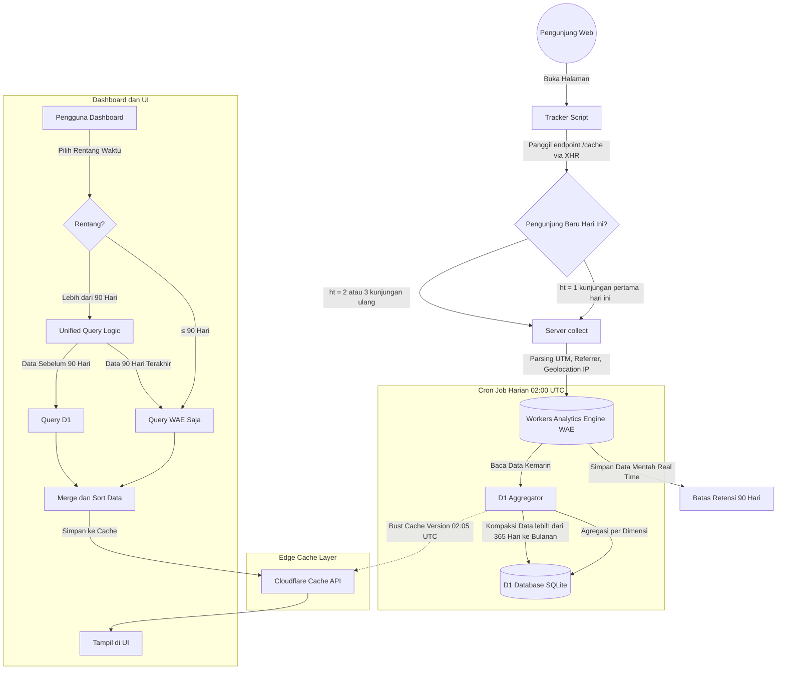

# Arsitektur & Cara Kerja Seeflare (Deep Dive)

Seeflare adalah platform analitik web modern yang dirancang di atas ekosistem Cloudflare. Tujuan utamanya adalah memberikan analitik yang **super cepat**, **tanpa cookie (menghormati privasi)**, dan **menyimpan riwayat selamanya** tanpa biaya penyimpanan database yang membengkak.

Berikut adalah penjelasan mendalam (termasuk pembahasan teknis 1:1 sesuai dengan struktur *codebase*) tentang bagaimana seluruh komponen sistem beroperasi secara harmonis.

---

## 1. Flowchart Arsitektur Keseluruhan

---

## 2. Tracker (Pengumpulan Data di Klien)
**Lokasi Kode:** `packages/tracker/src/`

Tracker adalah *script* kecil yang dipasang di sisi klien (browser pengunjung).
- **Pembahasan Teknis:** Tracker membaca `window.location` dan melakukan *parsing* elemen-elemen seperti *hostname*, *path*, parameter UTM, dan *referrer* otomatis (baik dari `document.referrer` maupun parameter URL). Tracker juga mendukung aplikasi *Single Page Application* (SPA) dengan memantau fungsi `pushState` dan `replaceState` agar transisi halaman tetap terekam.
- **Pelacakan Tanpa Cookie (Cookieless):** Tracker tidak menggunakan `document.cookie` atau `localStorage` untuk melacak pengunjung unik (sehingga bebas dari regulasi *Cookie Banner*). Sebaliknya, sistem menggunakan fungsi `checkCacheStatus()` melalui **proses dua fase permintaan (two-phase request)**:

  **Fase 1 — Pengecekan Hit Count:** Tracker membuat permintaan XHR `GET` aktif ke endpoint `/cache` di server, dengan mengirimkan `sid` (Site ID). Endpoint ini mengevaluasi header `If-Modified-Since` yang dikirim oleh cache native browser dan mengembalikan **respons JSON `{ ht: number }`** yang menunjukkan jumlah hit untuk pengunjung saat ini. Server juga menyetel header `Last-Modified` pada respons agar browser mengirimkan `If-Modified-Since` pada permintaan berikutnya. Tracker membaca nilai `ht` dari body JSON tersebut.

  - Jika `ht = 1`, ini adalah kunjungan pertama hari ini (pengunjung unik baru).
  - Jika `ht = 2`, ini adalah kunjungan ulang (memicu koreksi anti-bounce).
  - Jika `ht = 3` atau lebih, ini adalah page view biasa (dibatasi maksimal 3 untuk menghindari paparan jumlah hit yang tepat secara publik).
  - **Sistem Fallback:** Jika pengecekan cache ini gagal, tracker tidak lagi mengasumsikannya sebagai pengunjung baru, melainkan mendelegasikan pengecekan ke sisi server untuk mencegah inflasi data unik.

  **Fase 2 — Kirim Analitik:** Setelah mendapatkan hit count, tracker mengirimkan permintaan kedua `GET /collect?sid=...&ht=...&p=...` berisi seluruh payload analitik (path, referrer, parameter UTM, hit type) melalui `XMLHttpRequest` (XHR).

---

## 3. Server (Titik Penerimaan `/collect`)
**Lokasi Kode:** `packages/server/app/analytics/collect.ts`

Endpoint `/collect` adalah pintu gerbang lalu lintas analitik berkecepatan tinggi.
- **Pembahasan Teknis:** Saat permintaan `GET` masuk, fungsi `collectRequestHandler` akan melakukan hal berikut:
  1. Ekstrak data dari *query string* (seperti `sid` untuk Site ID, `p` untuk Path, `r` untuk Referrer).
  2. Parsing `User-Agent` untuk mendapatkan versi Browser dan model Perangkat (Desktop/Mobile).
  3. Mengambil properti spesifik Cloudflare (`request.cf.country`) untuk mendeteksi asal negara berdasarkan IP.
  4. Menerjemahkan *Hit Count* (dari parameter `ht`) menjadi *Bounce Value*: jika *hit* = 1 dihitung *bounce*, jika *hit* = 2 dihitung *anti-bounce* untuk mengoreksi yang sebelumnya, dan jika *hit* = 3 atau lebih tidak memiliki efek bounce.
  5. Menulis struktur `DataPoint` (berisi *Indexes*, 15 *Blobs* teks, dan *Doubles* angka) langsung ke **Workers Analytics Engine (WAE)**.
  6. Mengembalikan gambar transparan biner tipe `image/gif` dengan format 1x1 *pixel* dan *header* `Tk: "N"` (Tidak dilacak), serta *header* modifikasi waktu sebagai penanda cache.

---

## 4. Workers Analytics Engine (WAE) - Database Primer
**Lokasi Kode:** `packages/server/app/analytics/query.ts`

WAE adalah penyimpanan data analitik *time-series* dari Cloudflare.
- **Pembahasan Teknis:** WAE dirancang untuk *Write-Heavy workload* (tahan menelan jutaan event per detik tanpa jeda). Oleh karena itu, Seeflare memilih ini sebagai garda terdepan.
- **Trade-Off (Batasan 90 Hari):** Berdasarkan aturan Cloudflare, data detail dalam WAE hanya bertahan maksimal 90 hari. WAE cocok untuk *real-time dashboard* dan kueri berat jangka pendek (menggunakan SQL via Cloudflare API), tetapi data lama akan dihapus permanen oleh sistem pusat.

---

## 5. D1 Aggregation (Agregator & Penyimpanan Historis)
**Lokasi Kode:** `packages/server/app/analytics/d1-aggregation.ts`

Untuk memecahkan masalah batasan 90 hari milik WAE, Seeflare menggunakan *Cron Job* harian dan database relasional **D1 (SQLite)**.
- **Pembahasan Teknis:**
  Fungsi `runDailyAggregation` dipicu setiap pukul 02:00 UTC. Proses ini akan:
  1. **R2 Backup & Cleanup:** Pertama-tama secara sekuensial mencadangkan data mentah terbaru ke dalam file Arrow di Cloudflare R2 dan membersihkan file *backup* lama (usia >95 hari) agar biaya penyimpanan tidak membengkak.
  2. **Agregasi WAE:** Melakukan *query* ke WAE untuk membaca seluruh total pengunjung, *views*, dan *bounce* untuk setiap hari yang belum diagregasi sejak agregasi terakhir yang berhasil. Untuk mencegah kehilangan data akibat keterlambatan masuknya log (*late-ingestion*) pada WAE, cron ini juga selalu melakukan re-agregasi (menggunakan metode *UPSERT*) untuk **2 hari terakhir** secara otomatis.
  3. Memasukkan (*Insert* / *Update*) hasil perhitungan ringkas (Agregat) ini ke dalam tabel SQLite `daily_aggregates` menggunakan mode *Batch* `db.batch()` (maksimal 50 pernyataan sekali jalan untuk menjaga limit CPU Worker).
  4. **Kompaksi Otomatis (Compaction):** Fungsi `compactOldData()` akan berjalan setelah agregasi selesai. Jika ada deretan data yang usianya melebihi `DEFAULT_COMPACTION_DAYS` (standarnya 365 hari / 1 tahun), maka data harian dari bulan tersebut akan ditotal (*SUM*) lalu dirapatkan menjadi 1 baris bulanan (`granularity = 'month'`). Proses ini kini berjalan secara transaksional (atomik) untuk menjamin tidak ada data yang terhitung ganda walau sistem terhenti di tengah jalan, memastikan ukuran D1 tidak membesar tak terkendali.
  5. **Backfill Pertama Kali dari R2:** Pada jalannya yang pertama (ketika belum ada metadata agregasi sebelumnya), sistem juga akan mencoba melakukan backfill data historis per kolom dari file backup Arrow di R2 sebelum mengagregasi data WAE.

---

## 6. Unified Query (Penggabungan UI Statistik WAE + D1)
**Lokasi Kode:** `packages/server/app/analytics/unified-query.ts`

Sistem kecerdasan yang membuat transisi antar database tidak terlihat oleh pengguna.
- **Pembahasan Teknis:** Ketika UI (Dashboard) meminta statistik (misal fungsi `getViewsGroupedByInterval`), permintaan diteruskan ke `UnifiedAnalyticsQuery`.
  - Ia mengecek fungsi `isExtendedInterval(interval)`. Jika pengguna memilih rentang waktu **≤ 90 Hari** (misal 30 hari, atau tepat 90 hari), maka logika hanya akan meneruskan *query* 100% murni ke WAE.
  - Jika pengguna memilih **> 90 Hari** atau "All Time":
    1. Fungsi `computeDateRangeSplit()` akan memotong rentang waktu menjadi dua zona akurat berdasarkan UTC. (Zona WAE = 90 hari terakhir. Zona D1 = Sisa hari dari sejak website dipasang sampai **H-90**, yaitu hari sebelum titik awal lookback 89 hari WAE).
    2. Sistem akan melempar *query* secara paralel (bersamaan) menggunakan `Promise.all()` ke fungsi pencari D1 dan fungsi pencari WAE. Query D1 akan secara cerdas memfilter data ringkasan bulanan di perbatasan tanggal awal agar tidak terjadi *over-counting*.
    3. Setelah kedua *array* dikembalikan, fungsi gabungan akan menyatukan struktur data SQLite dan WAE tersebut. Nilai negatif pada *bounces* akan dikoreksi otomatis sebelum diurutkan (*Sort*). Untuk interval yang panjang, data time series juga dapat dibucket ke dalam agregasi mingguan (`WEEK`) atau bulanan (`MONTH`) sebelum ditampilkan.

Hasil akhirnya, *UI Chart* menampilkan satu grafik bersambung mulus bertahun-tahun.

---

## 7. D1 Cache (Akselerasi UI)
**Lokasi Kode:** `packages/server/app/analytics/cache-layer.ts`

Untuk memastikan UI tidak melambat meski *Unified Query* sedang bekerja berat mengambil data tahunan dari SQLite, Seeflare mengimplementasikan fungsi Edge Caching.
- **Pembahasan Teknis:** Menggunakan *Cloudflare Cache API*, setiap JSON balasan kueri akan dikunci (*hash*) dari gabungan filter dan *URL parameter* (Fungsi `buildCacheKey`).
- Hasil di-cache pada *edge server* (berdekatan dengan kota pengguna) secara normal selama 60 detik (`DEFAULT_TTL_SECONDS`).
- **Otomasi Pembersihan Cache (Cache Busting):** Untuk memastikan angka statistik baru (pasca-Agregasi Harian) langsung tampil di *dashboard* tanpa menunggu cache lama basi, *key cache URL* ditambahkan versi waktu `v=...` melalui fungsi `getCacheVersion()`. Fungsi matematis versi ini akan bertambah secara otomatis pada pukul **02:05 UTC** (memberi waktu 5 menit untuk Cron Job 02:00 UTC menyelesaikan Agregasi D1). Sejak detik itu, seluruh kunci cache sedunia otomatis hangus dan meminta data segar yang sudah diagregasi.

---

Melalui arsitektur kompleks namun rapi ini, Seeflare memberikan fungsionalitas sekelas *Google Analytics* tanpa melanggar privasi, tanpa batasan penyimpanan waktu, dan biaya operasional mendekati nol berkat pemisahan Database Agregat (D1) dan Database Fast-Ingest (WAE).
